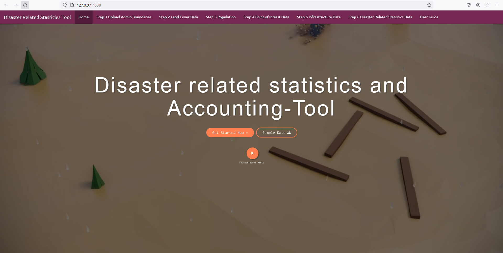

# Disaster-Related-statistics-accounting-tool

In this tool users will be able to identify the impact of hazard on Land Cover,Population, Point of Intrest and Infrastructure 
layers and result in producing impact of hazrd on this layers and genearate stasticies tabe and accounting reports. 

Tutorial :  https://www.youtube.com/watch?v=XQM6dZyncCg

URL : https://aahlaad-musunuru.shinyapps.io/Natural_Hazard_Damage_Assesment_Tool/

To test the tool click on sample data button to download and unzip the sample data where the users can get 5 different groups of input data sets.Useres can upload the sample data in to the tool and generate the accounts.
## Data used in each setp 
1) Admin Boundaries, Natural Hazard ,Metardata
2) Land Cover,Colors
3) Population (Total Population, Children, Population age>60,Population<15 years, Female population) ,Population And Socio economic Indicators
4) Point of Interest 
5) Infrastructure 

### Help & feedback

Contact :Aahlaad Musunuru

Email: aahlaadmusunuru1995@gmail.com
