# Disaster-Related-statistics-accounting-tool
Acknowledgement: 
For more information on how to use the disaster-Related-statistics-accounting-tool and any advise and bug reporting regarding the tool please.

Contact: Aahlaad Musunuru.
Email:   aahlaadmusunuru1995@gmail.com

- [Disaster-Related-statistics-accounting-tool](#disaster-related-statistics-accounting-tool)
    - [Background](#background)
  - [Data required](#data-required)
  - [Steps how to use the tool](#steps-how-to-use-the-tool)
    - [Step-1 Upload Admin Boundaries](#step-1-upload-admin-boundaries)
    - [Step-2 Land Cover](#step-2-land-cover)
    - [Step-3 Population](#step-3-population)
    - [Step-4 Point of Interest](#step-4-point-of-interest)
    - [Step-5 Infrastructure Data](#step-5-infrastructure-data)
    - [Step-6 Disaster Related Statistics Data](#step-6-disaster-related-statistics-data)
    - [Reference data](#reference-data)

### Background
The disaster related statistics and accounting tool is developed using R-Shiny application. In this tool users will be able to identify the impact of hazard on Land Cover,Population, Point of interest and Infrastructure layers and result in producing impact of hazard on this layers and generate statistics table and accounting reports. Users can user their one spacial data to generate accounts.I recommend to use the  

Tutorial :  https://www.youtube.com/watch?v=XQM6dZyncCg

URL : https://aahlaad-musunuru.shinyapps.io/Natural_Hazard_Damage_Assesment_Tool/

## Data required 
The data set required to use this tool is geographical extent or  admin Boundaries data, meta data, natural hazard layer, land Cover data, color codes, point of interest data and infrastructure data layer. 

## Steps how to use the tool

The Overall R-shiny application is divided in to 6  different steps. In each step the users need to upload different spacial data sets in to the tool.  

1) Step-1 Upload Admin Boundaries
2) Step-2 Land Cover Data
3) Step-3 Population
4) Step-4 Point of interest Data
5) Step-5 Infrastructure Data
6) Step-6 Disaster Related Statistics Data

To test the tool click on sample data button to download and unzip the sample data .

Figure 1: Download the sample data  

where the users can get 5 different groups of input data sets. Users can upload the sample data in to the tool and generate the accounts. They can replace sample data and use their own spacial data to produce accounts. 

Figure 2: Sample Data Groups  

Click on get start button to produce accounts using R-shiny application tool. 

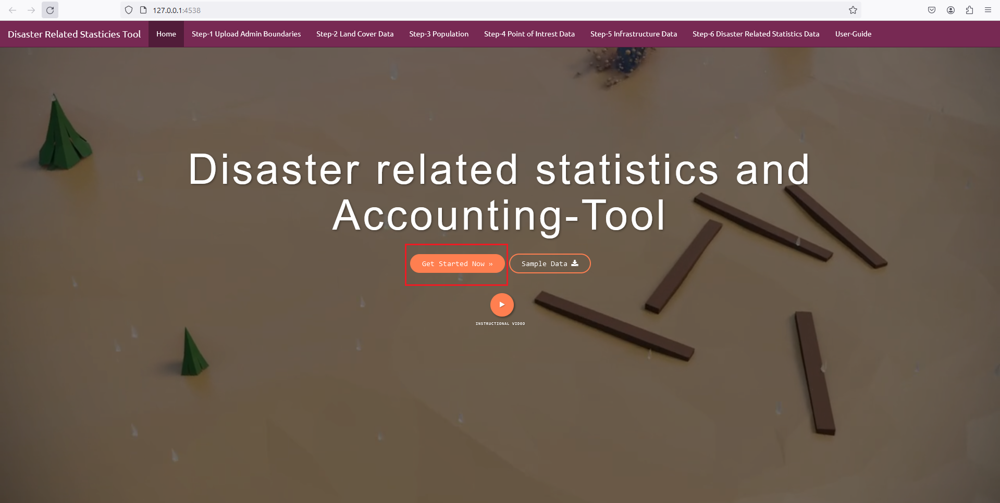

Figure 3: Get start to produce disaster related statistics and accounting-tool  

### Step-1 Upload Admin Boundaries
In the first step the users need to upload the geographic extent shape file data and select the Attribute Heading fallowed but this users need to select the Attribute Name. 

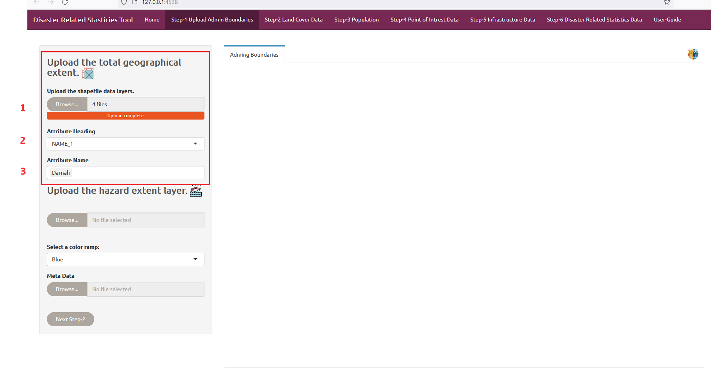

Figure 4: Upload the Admin Boundaries shape file data

Next they need to upload the Natural hazard boundaries Shape file data and select the Attribute Heading and Attribute Name. Users can also change the hazard color codes if they are intrusted. Then the users need to upload the metadata information as a '.csv' file. Now click on next button to go to step-2 Land Cover Data panel. 

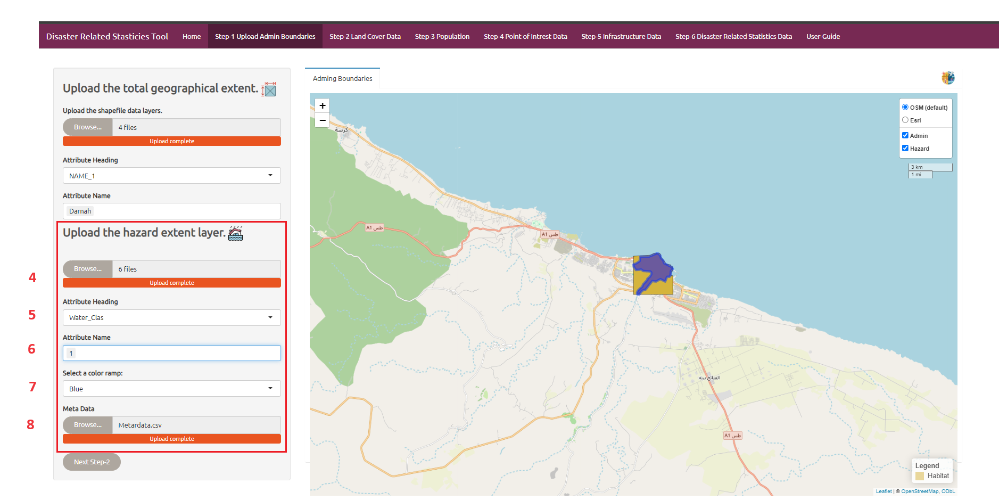

Figure 5: Upload the Natural hazard Boundaries shape file data

### Step-2 Land Cover 
In the step 2 user first user need to upload the land cover data which is in raster file format and color code based according to the pixel ID. Once the user uploaded this data sets they can click on Run Data button to produce accounts and reports. 

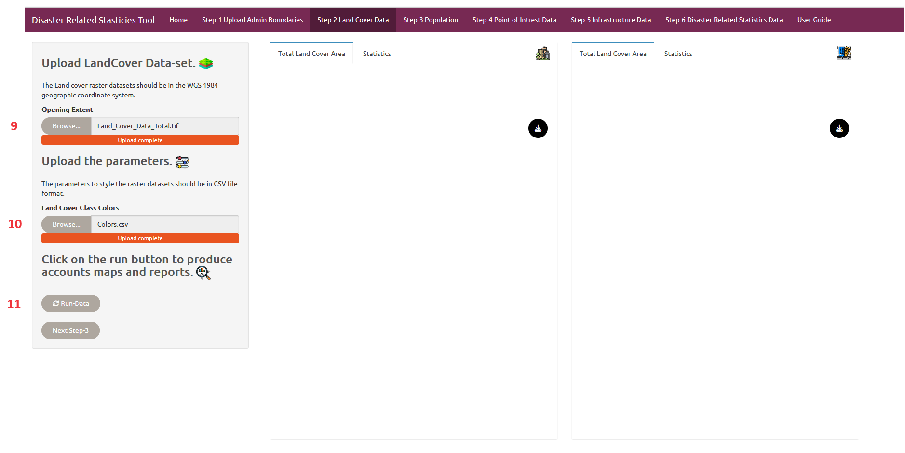

Figure 6: Impact of hazard on Land Cover 

Once the user click on Run Data button the total land cover map and the land cover map affected hazard are been displayed on the two map panels.  They can click on the download button to download the accounting report.

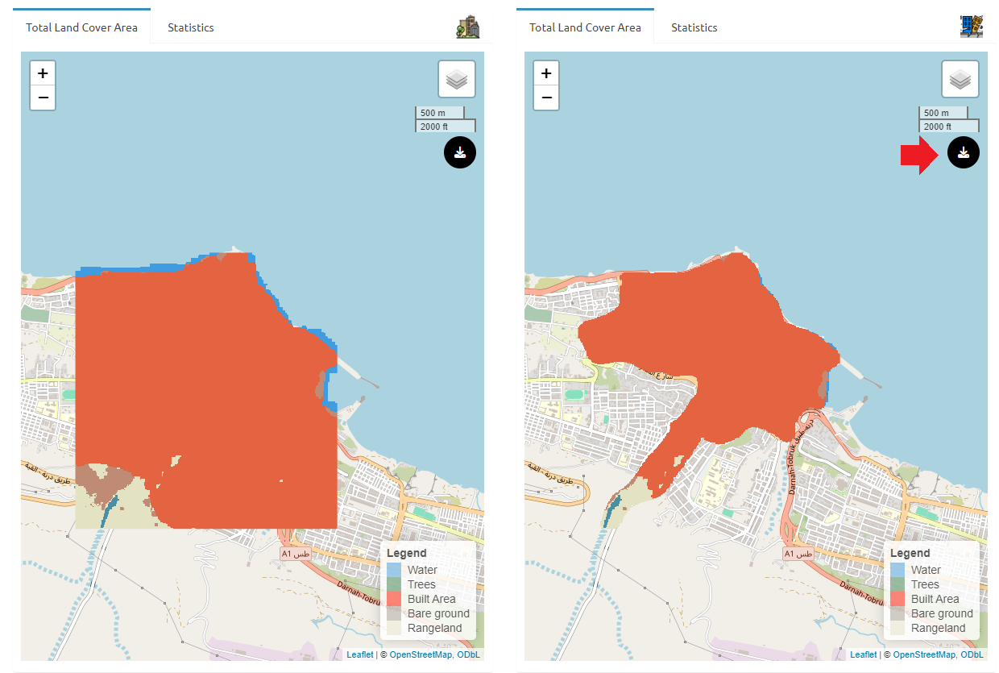

Figure 7: Land Cover affected to hazard map

| ID  | Classes      | Colors  |
|-----|--------------|---------|
| 1   | Water        | #419bdf |
| 2   | Trees        | #397d49 |
| 7   | Built Area   | #ff1400 |
| 8   | Bare ground  | #a59b8f |
| 11  | Rangelands    | #e3e2c3 |

Table 1: Classes and colors.

In the statistics tab users will be able to see the total land cover area statists with the percentage information moreover they can also observe the land cover exposed to hazard with percentage statists information. 

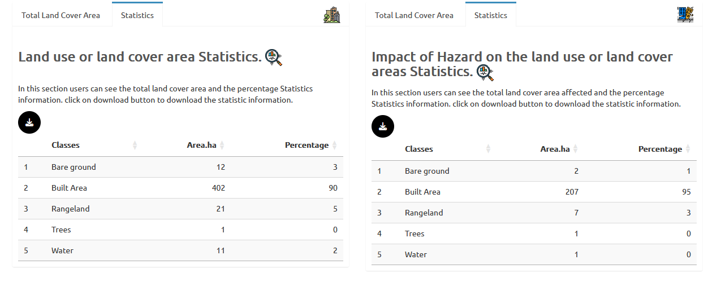

Figure 8: Land Cover Statistics

### Step-3 Population 

In this section the user need to upload the different layers  of population data fallowed with they also need to upload the names of the population indicators as a csv file. Then the uses can click on download button to download the accounting report.

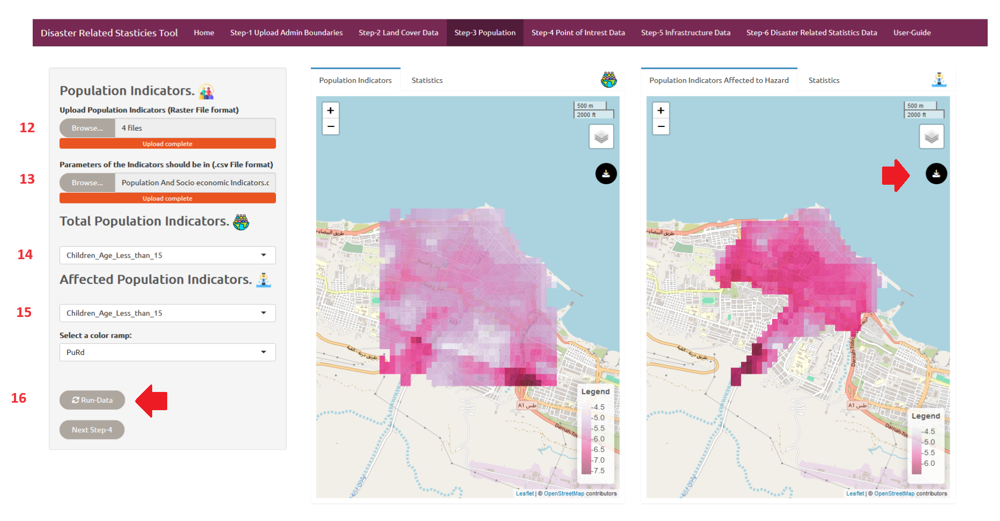

Figure 9: Population Statistics

   | Classes                     |
   |-----------------------------|
   | Children_Age_Less_than_15   |
   | Female                      |
   | Old_People_Age_Grate_than_60|
   | Population_Total            |

   Table 2: Population Classes Indicators.

### Step-4 Point of Interest

 In this step the users need to upload the point of Interest points shape file and select the attribute heading and click on run button .Then the total Point of Interest and the point of Interest affected to hazard  can be seen in the map panels. They can click on the download button on the map panel to download the accounting reports.

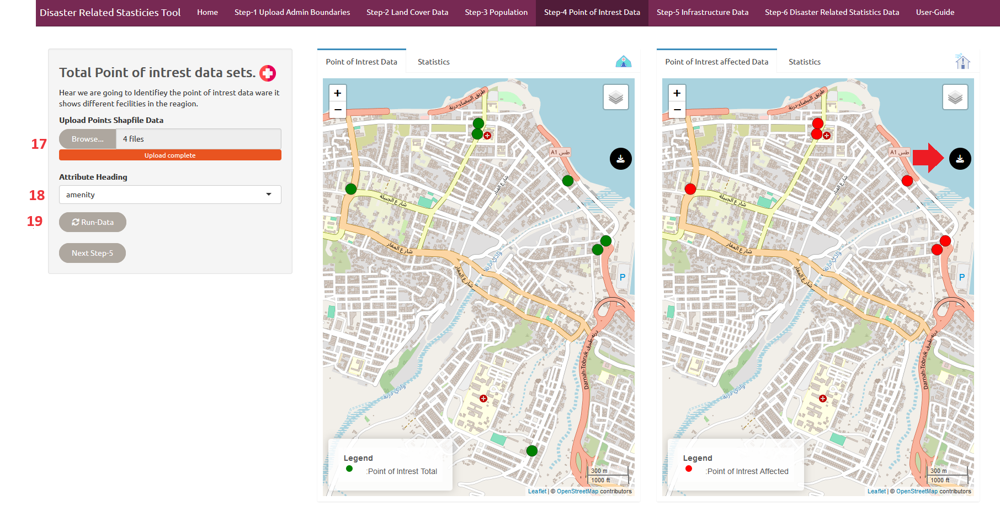

Figure 10: Point of Interest

Next click on the the statistics panel the users can download the total point of interest and the point of interest exposed to hazard statistics information. 

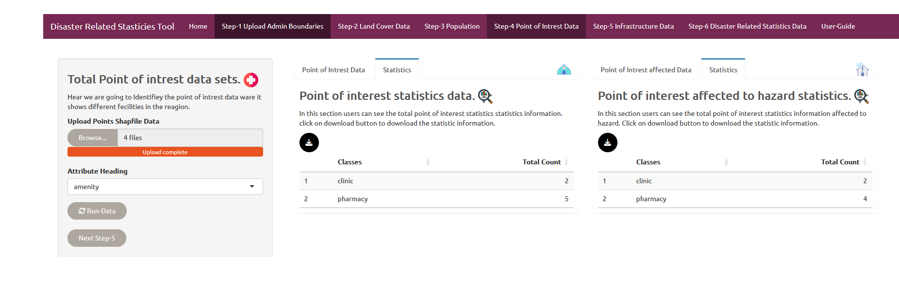

Figure 11: Point of Interest Statistics

### Step-5 Infrastructure Data 

In this step the users need to upload the Infrastructure line shape file and select the attribute heading and click on run button .Then the total Infrastructure  and the Infrastructure affected to hazard can be seen in the map panels. They can click on the download button on the map panel to download the accounting reports.

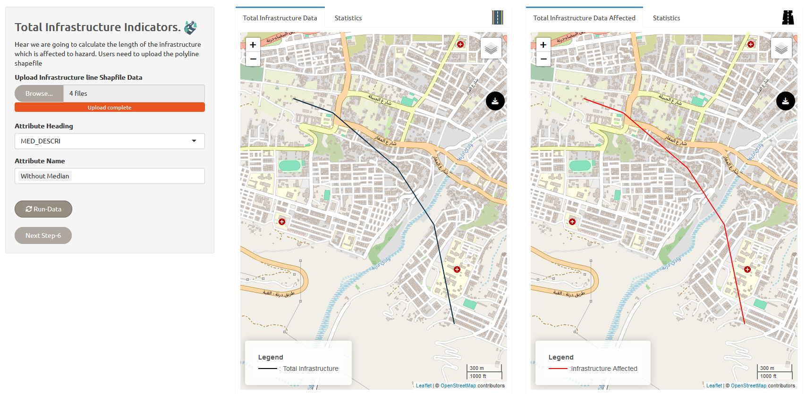

Figure 12:Infrastructure

Next click on the the statistics panel the users can download the Infrastructure   and the Infrastructure exposed to hazard statistics information.
 

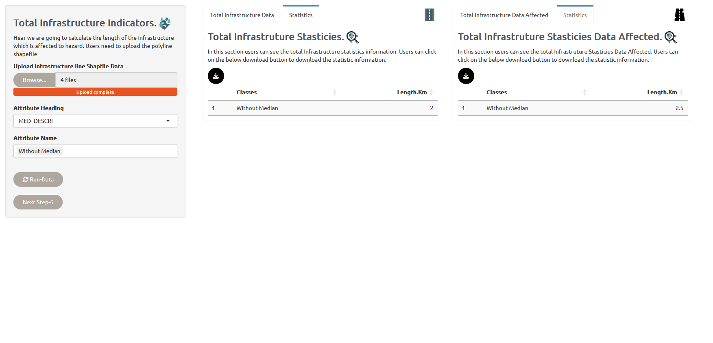

Figure 13: Infrastructure Statistics

### Step-6 Disaster Related Statistics Data  

In this step users can download the total disaster related statistics  information fallowed with they can also download the disaster affected statistics accounting report. In the map panels they can see the total extent of all the layers fallowed by the layers which are exposed to hared.

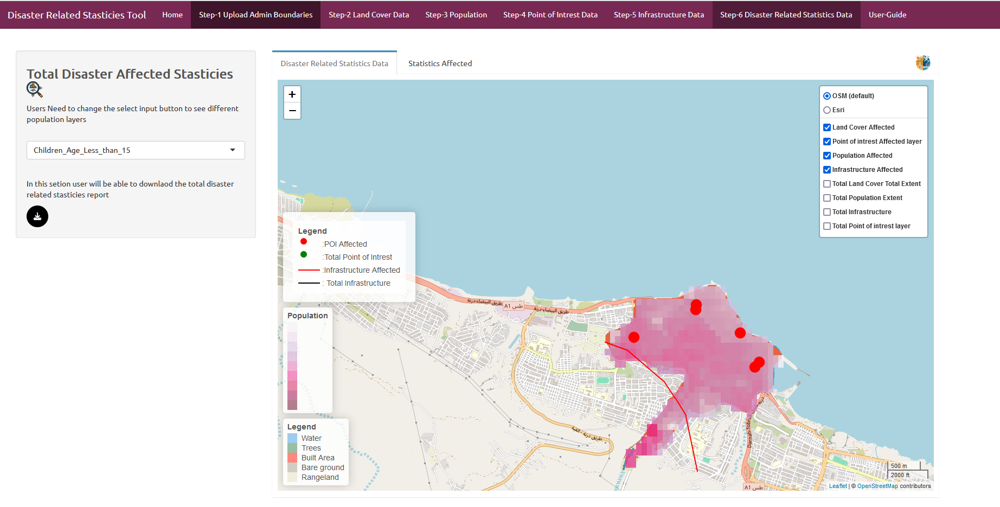

Figure 14:  Disaster Related Map Statistics Data Panel

The statistics panel users can see and download the statistics which provides the information of total land cover and the land cover exposed to hazard, the total of different population layers with the different population layers  affected to hazard, total Infrastructure layer length, with the Infrastructure affected to hazard,total point of interest layer with the number exposed to hazard all the information can be seen on the table.

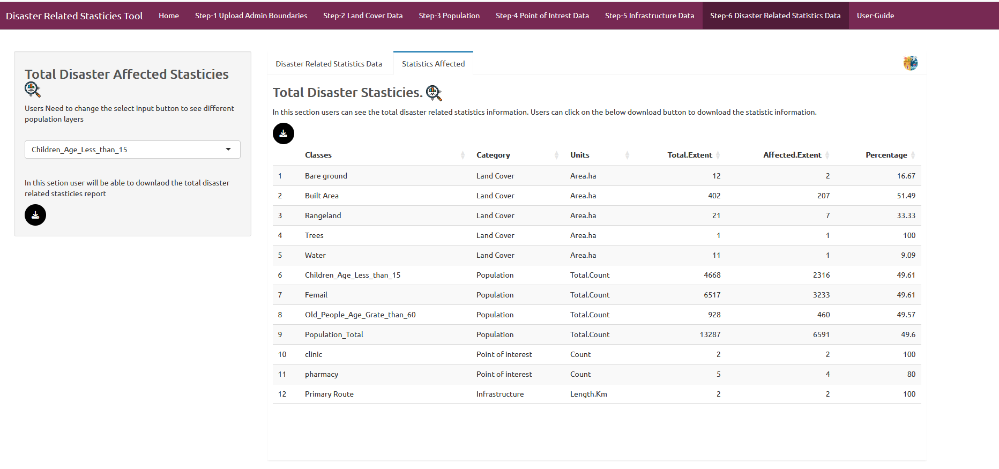

Figure 15:  Disaster Related Statistics Panel

From the side bar panel the users can download the disaster Affected statistics report. 

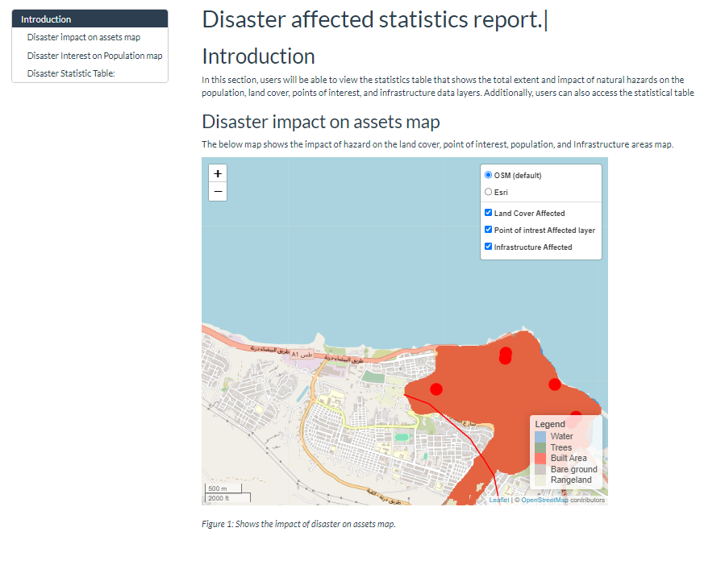

Figure 16:  Disaster Related Statistics End report

###  Reference data

| Data Set            | Data Source                              |
|----------------------|------------------------------------------|
| Flood               | [UNOSAT](https://unosat.org/products/3687)     |
| Population          | [WorldPop](https://www.worldpop.org/)          |
| Land Cover          | [ESRI-Living Atlas](https://livingatlas.arcgis.com/landcoverexplorer) |
| Point of Interest Data | [DIVA-GIS](https://www.diva-gis.org/Data)         |
| Infrastructure      | [DIVA-GIS](https://www.diva-gis.org/Data)         |
| Admin               | [DIVA-GIS](https://www.diva-gis.org/Data)         |

[def]: #step-1-upload-admin-boundaries